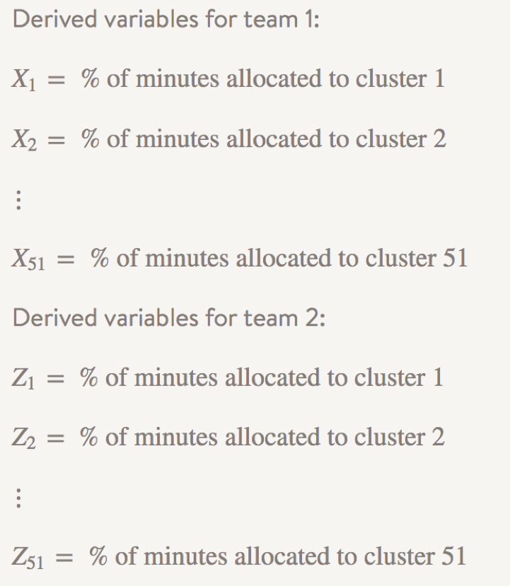
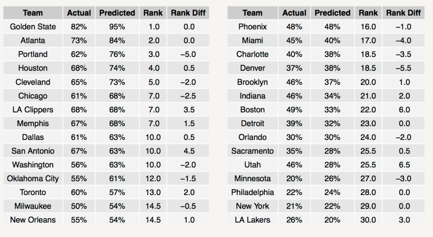

金州勇士队赢得了去年 NBA 常规赛和总决赛双料冠军，然而许多人认为他们的成功主要是因为运气好，他们的小球战术只适用于常规赛。

在 Stitch Fix 算法团队中有不少勇士队的忠实粉丝，因此我们打算从数据科学的视角来探索勇士队夺冠的决定因素。我们的分析结果中主要有两个重大的发现，这也是本文想要讨论的主要内容：
	

- 金州勇士队去年的成功绝非偶然，而是基于他们多元化、高效的阵容以及足够机智的教练团队（马刺出品，实属精品！）。
- 如果整个总决赛过程中凯文·乐福和凯里·欧文都保持健康的话，金州勇士队仍然会赢得最后的胜利——尽管他们可能遭遇非常激烈的七场系列赛决斗。

# 方法——高级视图
本文所用到的基本模型如下所示：如果我们可以构建出忽略近期胜负势头的预测模型，而且如果该模型预测金州勇士队将会成为去年最佳球队的话，我们可以认为勇士对的成功并非偶然。


为了更好地建模，我们需要了解球员原型对球队赢得给定比赛的概率的影响程度。我们专门建模探究上场时间的分配（取决于球队的阵容和教练的决定）将如何影响球队赢得比赛的能力。


换句话说，这个方法专注于探究团队 DNA的重要性，而不是一些比赛现场的临时因素。因此，我们主要探究2015赛季的金州勇士队是否拥有最好的球队 DNA。


## Step1:构建球员原型
我们利用 k-means 聚类法对 2011-2012 和 2012-2013 赛季的球员数据进行分析得到相应的球员原型（聚类结果）。原型是根据球员的统计数据所得到聚类结果的中心，我们可以将未来赛季中任何球员都映射到相应的原型中。

需要注意的是，原型基本上是球员场上表现的简化视图。利用原型来建模有利于增强模型的稳定性（考虑较大的样本个数而不仅仅是个别球员），因此我们可以在一定程度上避免超级明星的影响效应（这违背了我们基本模型的假定条件）。

## Step2:预测比赛结果

在步骤一利用 k-means 算法构建出球员原型后，接下来我们将估计各个类型的原型的重要性程度。

- 对于 2014-2015 赛季的任一给定比赛：根据该比赛前 90 个比赛日内所有比赛的统计数据来构建球员原型。

- 计算比赛双方球队之间各个原型上场时间的差值变量，然后利用该数据构建回归模型来预测比赛的胜者。从本质上来说，这意味着模型的预测结果是基于一个球队合理分配球员上场时间的能力。

需要注意的是，由于该模型利用成绩表数据进行建模，所以该模型并不知道球队在每个时点的表现情况以及球员之间的相互作用。换句话说，该模型忽略了一些比赛现场的临时因素。

另一方面，该模型主要利用教练分配给各个球员原型的上场时间，这意味着我们有效地考虑了球员受伤的情况。同时，上场时间的分配差异也可以反映出教练的执教水平。


## Step3:对比现实数据
对比模型的预测结果和真实比赛结果。这一步是分析的难点。如上所述，我们的观点基于一个前提条件——如果这个简单的模型真实地反映现实情况，那么我们可以认为成功并不是因为运气和一些神奇的协同效应。

***球员原型***


正如刚才提到的，我们利用 2011-2013赛季的成绩表数据构建 k-means 模型来获取球员原型的结果。以下是我们模型所使用的一些球员数据：
助攻、进攻和防守篮板、失误、抢断、得分、上场时间、三分球出手次数、投篮命中次数、投篮命中率、罚球次数、罚球命中率、盖帽、出场时间的比例以及效率值（NBA所计算的 EFF 值）


我们目的在于得到解释力为 80-90% 的解释模型，我们从场均上场超过 8 分钟的球员中选定 50 个球员原型，而另一原型为场均上场时间小于 8 分钟的球员，即总共分为 51 个原型。注意，每个赛季中大约有 400-450 名球员上场时间超过 8 分钟。


原型是真实球员的简化视图——他们是 k-means 聚类的各个类别中心。为了更好地理解聚类结果，我们创建了一张热感图，并绘制了 2014-2015 赛季中最活跃的 25 个原型（根据上场时间所刻画的）。图中右侧坐标轴的标签代表每个分类中最具代表性的球员，热感图中的数值代表各类中心的数值。


***预测比赛结果***

我们将利用各类原型的上场时间来预测某一球队赢得比赛的概率，同时估计出各类原型的重要性程度。我们将分三个部分来讨论这个内容：

- 模型中的预测变量

- 模型估计

- 验证方法和结果


***预测变量***

步骤二中的回归模型主要基于一个简单的思想：赢得比赛的概率可以由比赛中分配给不同类型球员的上场时间来预测。因此，对于每个球队，我们构建以下变量：



从这些变量中，我们计算出两队之间的差异。在给定的比赛中，我们通过以下公式构建“差值变量”：



***模型估计***

本文所构建的 logistic 回归模型如下所示：



其中，H 表示一个共用的主场指标，而不是某一特定球队的指标。模型的解释系数将根据比赛前 90 天的数据进行更新迭代估计，同时我们利用 L1 正则化方法（lasso）来选择重要性的变量，减少模型过度拟合的概率。因此，我们的目标可以视为解最优化问题：



其中 L(·) 表示标准 logistic 回归模型的对数似然估计函数值的相反数，而 lambda 则表示模型的惩罚系数。我们可以利用 R 中的 glmnet 包来解决该问题，该函数利用交叉验证法来确定惩罚系数的最佳估计值。

***系数更新过程***

如上所述，我们利用每一场比赛前 90 个比赛日的数据来重估计模型的系数（不包括非比赛日）。以下是我们这样处理的理由：

- 利用一个给定的球员原型来估计整个赛季的比赛结果会存在一定的偏倚。我们希望所构建的模型能够自适应调整。赛季开始初期，主要利用上赛季的数据进行建模。但是随着比赛的进行，建模的数据则完全基于当前赛季的历史比赛数据。

- 通过动态地调整模型和利用相当多的球员原型，我们可以将一些潜在的趋势纳入到模型中（这并不是我们基本模型的一部分）。然而，这些影响是无法量化的，我们决定将其纳入模型中。

***模型验证***

球队 1 获得比赛胜利的概率为：



其中，当 p 大于 0.5 时，我们认为球队 1 将获得比赛的胜利。需要注意的是，在给定 90 天时间窗口的前提下，很多变量的系数都会被压缩到 0（即被剔除出 L1 正则化模型）。


该模型利用一天预测来验证模型的准确性，这意味着该模型利用之前 90 个比赛日的历史数据来预测下一天的比赛结果。

利用这个验证方案，我们可以得出上半赛季的比赛预测精度为 61%，而下半赛季（包含季后赛）的预测精度为 66%。同时我们可以获得 ROC 曲线下的面积分别为 0.68 和 0.71。总体而言，该模型在保持简化的基础上还能保持一定的准确率，而且该

模型的准确率随着时间的推移也随之提高。
对于金州勇士队来说，常规赛的预测准确率达到 81%，而季后赛则为 76%。事实上，该模型倾向于更好地预测一些“极端”的球队。比如，该模型成功预测了洛杉矶湖人队 75% 的比赛——上个赛季湖人队的球员 DNA 水平比较低；对于圣安东尼奥马刺队，预测精度仅为 60%。

该模型较好地预测出各个球队的排名情况，其中该排名由模型预测的胜率排序所得。在下一章节中，我们将更详细地介绍这个内容。

***对比现实数据***

接下来是我们开始检验模型的假设条件。正如上述的基本模型所提到的，如果该“傻瓜式”模型的预测结果与上赛季的真实结果非常相近的话，那么我们可以认为金州勇士队的成功并非偶然。

该模型预言金州勇士队确实是上赛季的最佳球队（利用一期预测模型）。事实上，该模型预测勇士队将取得 78 胜 4 负的战绩！此外，该模型预测出金州勇士队将赢得全部四轮季后赛的胜利。因此，我们可以得出结论：金州勇士队的成功并不是因为运气好，而是他们拥有最佳的球队 DNA。

下表展示了 2014-2015 赛季各个球队真实的胜率和模型预测的胜率。同时该表还展示了预测排名以及排名误差。其中负排名误差表示该模型认为该球队应该赢得更多的比赛（如波特兰开拓者），而正排名误差则表示该球队的表现超出了模型的预期结果（如圣安东尼奥马刺队）。


接下来，我们看看该模型对季后赛的预测情况。从下表中我们可以看出，该模型略微乐观估计了对阵休斯顿火箭队和克利夫兰骑士队的系列赛战况。对休斯顿火箭队，该模型预测勇士将横扫对手，而对骑士队，该模型则认为勇士队只会输掉一场比赛.



***那么，为什么金州勇士队是一个好球队呢？***

上述的回归模型和原型分析证实了两件事：斯蒂芬·库里是球队的领袖，而且勇士队的上场时间分配很合理。

根据模型的系数，库里属于最重要的原型变量。另外，库里是 2014-2015 赛季中唯一一名从始至终满足该原型的球员。换句话说，库里一直高效地帮助球队获取胜利的果实。作为对比，我们发现开拓者队的利拉德只有30% 的时间满足库里这一原型变量。

金州勇士队还可以很好地将时间分配给其他几类重要原型的球员。这意味着金州勇士队的阵容实力非常雄厚（也就是说他们具有较好的DNA），同时他们的教练懂得如何高效地将时间分配给这些球员。

下图则形象地展示了上述的情形：图中条形图的宽度代表该类原型变量的重要性而长度则代表分配到该类型球员的盈余时间（也就是 logistic 模型中的 Dj）。从下图中我们发现森林狼队将大部分时间分配给表现力较差的原型球员，这也解释了为什么他们去年只获得了 20% 比赛的胜利。



>【译者注】左下角表示波士顿凯尔特人队。

***如果凯文·勒夫和凯里·欧文没有受伤的话，比赛将会演绎？***

我们都听过这样的言论：如果凯文·勒夫和凯里·欧文保持健康的话，骑士队将会获得最后的胜利。因此，我们觉得这个问题值得建模分析。以下是我们的处理过程：

- 识别出上赛季中金州勇士队和克利夫兰骑士队所有核心球队都保持健康的比赛。这场比赛是 2015 年 2 月 26 日在克利夫兰举行的比赛。虽然模型预测金州勇士将获得比赛的胜利，但最终却是克利夫兰骑士队赢了。这场比赛提供了这些球员保持健康情况下的上场时间分配值。

- 移步到季后赛中，并将该数据代入模型中。回想以下，该模型是个自适应更新的模型，此时球员们已经被映射到不同的原型中。因此，2015年 2 月的预测结果将不同于 2015 年 6 月的预测结果。


# 其他潜在的应用
如果我们打算利用这个模型预测未来比赛的情况，而不是作为后验预测模型来检验假设条件，那么我们必须假设每个球员的上场时间，然后将其映射到各类原型中。这将导致一个有趣的假设场景——教练可以在赛前制定好时间分配的方案，就像企业在各个季度和年度执行计划方案。



# 结语
当然了，没有准确的说法来证明金州勇士队的成功来源于运气还是其球队基因。我们的方法仅仅是提供了一个新的视角，其他数据分析团队可能会得出完全不同的答案。没有人会知道绝对正确的答案。

然而，基于我们的分析结果，以及这个赛季（2015-2016赛季） 15-0 的梦幻般开局，其中包括两次战胜了洛杉矶快船队——其主教练里夫斯就是“运气论”的支持者。我们感觉金州勇士队在复制上赛季的成功之旅。
>【译者注】译者小幅更新了本段内容。

金州勇士队的球员基因和上赛季基本一致，但是勇士队将会表现地比上赛季更好。我们计划通过这个模型继续预测和监测勇士队的战绩。敬请期待！

----

	原文链接: http://multithreaded.stitchfix.com/blog/2015/11/05/nba/

	原文作者：JOERG FRITZ, KIM LARSEN

	翻译：Fibears








